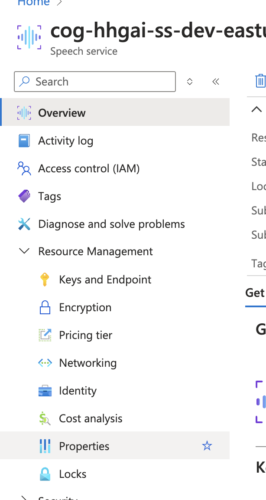

# Setting up .env file

1. Create a `.env` file in the backend folder using the template in `.env.sample`

## Getting Speech Resource ID

1. Select the correct resource
2. Under 'Resource Management' click on properties
3. Copy the 'Resource ID' from the properties tab and add it into your `.env` file

## Getting Speech Region

1. In the same resource management tab, click on 'Keys and Endpoint'
2. Copy the 'Location/Region' into your `.env` file
